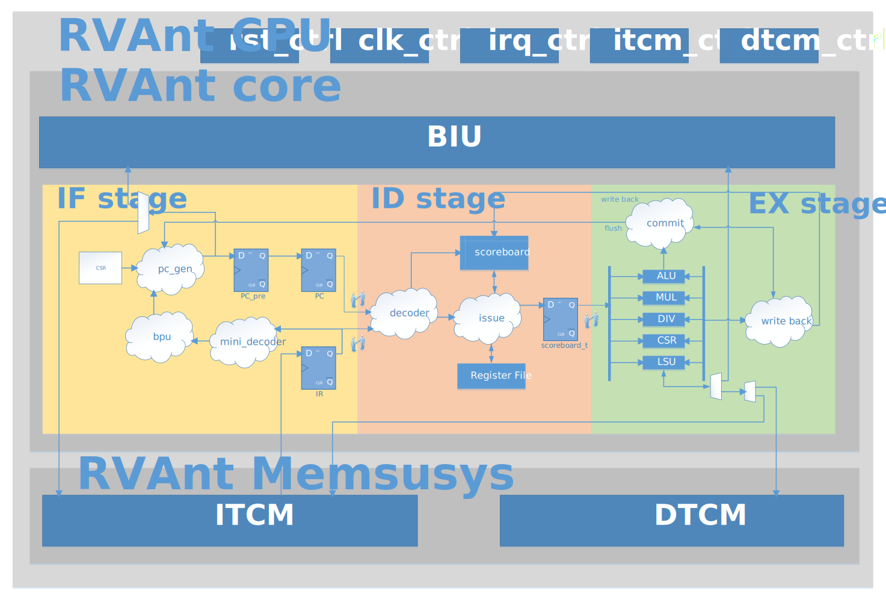

English | [简体中文]()

# RVAnt :ant:

[]()

RVAnt is a minimal implementation of RV32I written in SystemVerilog for individual study purpose.

## Table of Contents

- [RVAnt :ant:](#rvant-ant)
  - [Table of Contents](#table-of-contents)
  - [Features](#features)
  - [Microarchitecture](#microarchitecture)
  - [Performance](#performance)
  - [Directory Description](#directory-description)
  - [Build and Test](#build-and-test)
  - [Documents](#documents)
  - [Versioning](#versioning)
  - [Style Guide](#style-guide)
  - [Contributing](#contributing)

## Features

- RV32I[M]_Zicsr_Zifencei
- M-mode only
- 3-stage pipeline
- in-order single issue
- out-of-order execution
- writen in SystemVerilog
- MIT license

## Microarchitecture

The microarchitecture of RVAnt:



## Performance

## Directory Description

| Module                | Description                                                           |
| --------------------- | --------------------------------------------------------------------- |
| `rvant`               | The RVAnt CPU                                                         |
| `rvant_axi`           | The version of the CPU with AXI4-Lite interface                       |
| `rvant_axi_adapter`   | Adapter from PicoRV32 Memory Interface to AXI4-Lite                   |
| `rvant_wb`            | The version of the CPU with Wishbone Master interface                 |
| `rvant_pcpi_mul`      | A PCPI core that implements the `MUL[H[SU\|U]]` instructions          |
| `rvant_pcpi_fast_mul` | A version of `picorv32_pcpi_fast_mul` using a single cycle multiplier |
| `rvant_pcpi_div`      | A PCPI core that implements the `DIV[U]/REM[U]` instructions          |

## Build and Test

## Documents

You can build the documents on your local machine using sphinx, 

```bash
cd doc
pip3 install -r requirements.txt
make clean
make html
```

or read the [online documents]().

## Versioning

Follow the [SemVer](https://semver.org/spec/v2.0.0.html)

## Style Guide

Check out [LowRISC Style Guide](https://github.com/lowRISC/style-guides/blob/master/VerilogCodingStyle.md).

## Contributing

Follow the [conventional Commits](https://www.conventionalcommits.org).